# local-3d: a local "Meshy" on Apple Silicon

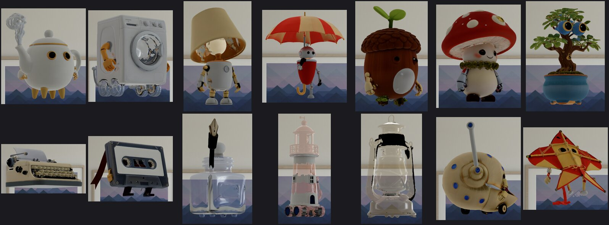

<sub>Fourteen characters made by `m3d` from text prompts, rendered by RealityKit in the visionOS simulator (the acceptance test, `viewer/render.sh`). All AI-generated: concepts by Z-Image Turbo, meshes and textures by Hunyuan3D.</sub>

`m3d` turns a text prompt (or a photo) into a textured, game- or Vision Pro-ready 3D model, then rigs and animates it, entirely on one Mac with no cloud service and no credits. One command chains open models and Apple's own tools: a concept image (mflux Z-Image Turbo or Qwen-Image), a background cutout (Apple Vision), image-to-3D (Hunyuan3D in Swift/MLX, or Pixal3D and TRELLIS.2 through ComfyUI), a Blender re-bake into clean GLB + USDZ with LODs, then an auto-rig (SkinTokens on Metal, or a deterministic "puppet" rig for objects), procedural or text-to-motion animation, and one USDZ per clip that RealityKit actually plays. Every model is a row in one config file, every stage is timed into `bench/runs.tsv`, and a GPU guard keeps it from colliding with a local LLM on the same unified memory. It was built and measured on an M5 Max with 128 GB, mostly by coding agents working to the rules in [`CLAUDE.md`](CLAUDE.md).

## One asset, end to end

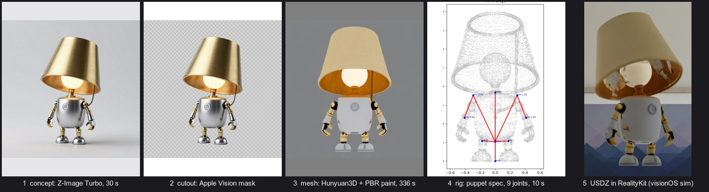

<sub>One `m3d make "…" --post visionos` run (377 s wall) plus one `m3d rig --engine puppet` (10 s). Timings from the run's `run.json`. The RealityKit render (right) shows what the mesher could not see: the inside of the shade was never in the concept image, so it is painted with smeared texture.</sub>

<details><summary>The prompt</summary>

> a tiny cute robot character whose head is a conical brushed brass table-lamp shade tilted forward as if listening, a warm amber glowing panel under the shade as its whole face with no eyes, a small chrome body with a round power button on its chest, a beaded pull-chain hanging off one side like a ponytail, tiny segmented brass arms with claw hands, two short chrome legs with rounded feet, endearing

`m3d` wraps it in a template (`m3d.toml` `[concept]`) that asks for one object, three-quarter view, plain grey backdrop, no shadow.
</details>

| Puppet rig: idle, wave, hop (Blender) | SkinTokens auto-rig: idle, hop (Blender) | SkinTokens rig in RealityKit: wave, hop |
|---|---|---|
| 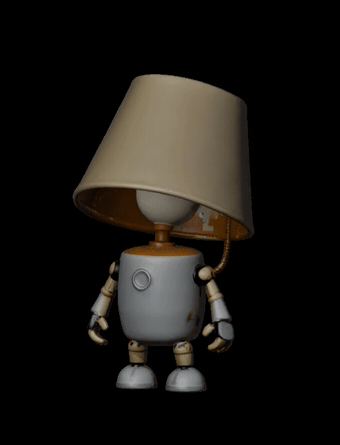 | 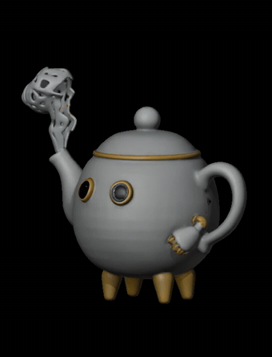 | 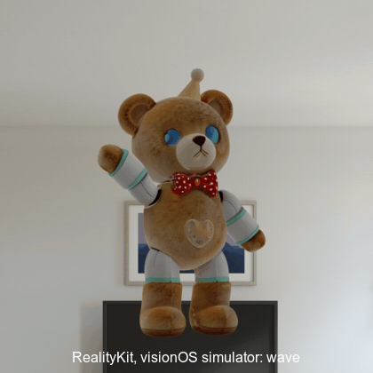 |
| `m3d rig --engine puppet --spec specs/puppet/07-lamp-robot.json`, then `m3d animate --clips idle,wave,hop` | `m3d rig` (SkinTokens, 65 s), `m3d animate --clips idle,hop`; animcheck: **warn** on both | Screenshot burst from the simulator (`viewer/burst.sh`), so the frame rate is the burst's, not the clip's. animcheck: **warn** on wave and hop (edge stretch at the shoulder seams) |

<sub>All three are AI-generated models with procedural animation from `lib/motion.py`. The GIFs are excerpts converted from the check renders in the output folder.</sub>

<p align="center">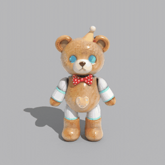</p>

<sub>The teddy's `wave` clip GLB, exactly as `m3d animate` wrote it, rendered by [`docs/orbit.py`](docs/orbit.py) in Blender Cycles (CPU, 16 samples, 72 frames in 1 min 51 s) while the camera circles it once; the clip loops twice. Only the front was in the concept image, so the back and sides are the mesher's guesses. Rendered 2026-10-05 for this README.</sub>

## Usage

```bash
m3d make "a stylized wooden treasure chest" --post visionos   # text → GLB + USDZ (~7 min)
m3d make photo.png --draft                                     # image → untextured shape, ~10-15 s
m3d concept "a knight" --variants 4                            # just concept images, one contact sheet
m3d mesh concept.png --engine pixal3d                          # one image → mesh (MIT models + DINOv3 licence)
m3d post model.glb --preset game                               # re-bake to 20k tris + LODs
m3d post model.glb --preset hero --glass green                 # see-through tinted glass
m3d make "…" --dry-run --json                                  # the plan as JSON, nothing run
m3d rig model_LOD0.glb                                         # skeleton + weights + bone roles (SkinTokens, Metal)
m3d rig model_LOD0.glb --engine puppet --spec auto             # deterministic rig for objects and robots
m3d animate rig/model_LOD0-rigged.glb --clips idle,wave,hop --usdz --check   # one GLB + USDZ per clip
m3d animate rig/model_LOD0-rigged.glb --text "a person waves hello" --usdz   # bipeds: text-to-motion
m3d gpu                                                        # is the GPU free? (exit 3 if not)
m3d models                                                     # what m3d.toml offers, with licences
```

Exit codes: 0 ok, 2 usage, 3 GPU busy, 4 a stage failed, 5 cutout refused. `m3d --help` prints recipes by intent. With `--json`, every command prints one JSON object with full paths, wall time and what it did, which is what calling agents read ([`skills/m3d/SKILL.md`](skills/m3d/SKILL.md) is the agent skill).

## Architecture

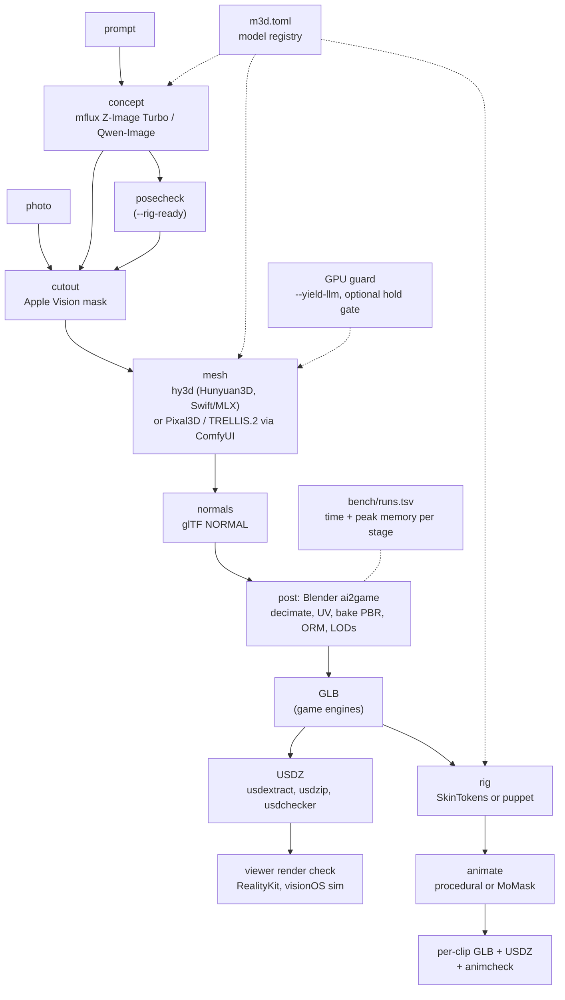

Every stage is a worker in `lib/` (or an upstream tool) that `bin/m3d` runs from a command template in `m3d.toml`, under `run_stage`: wall time and peak memory (`/usr/bin/time -l`) go to `bench/runs.tsv`, a stage that is silent for 15 minutes or passes its `max_seconds` is stopped, and a stage only counts when it prints its success marker (`M3D_POST`, `M3D_RIG`, `M3D_ANIM`, `M3D_MOTION`), because Blender exits 0 after a Python traceback.

The rig and animate half, per clip:

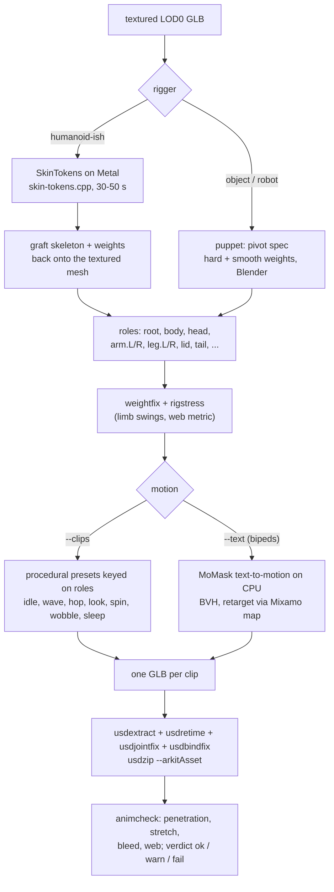

| Stage | What runs | Where |
|---|---|---|
| concept | mflux Z-Image Turbo 4-bit (default) or Qwen-Image-2.1 | `uv tool` mflux 0.20.0 |
| cutout | Apple Vision foreground mask (`lib/vision-cutout.swift`, default) or colour key (hy3d-mcp `cutout.py`) | Swift / worker venv |
| mesh | `hy3d` (Hunyuan 2.0 shape + 2.1 PBR paint), Pixal3D / TRELLIS.2 via ComfyUI (`lib/comfy3d.py`, with `comfy_nodes/` moving the mesh post-processing nodes to CPU) | see `m3d.toml` |
| normals | injects the glTF `NORMAL` attribute the engines omit (hy3d-mcp `normals.py`) | worker venv |
| post | `lib/ai2game.py`: decimate or voxel or QuadriFlow → new UVs → bake base colour, roughness, metallic, normal → ORM pack → LODs → GLB (Y-up, metres), on CPU unless `--metal` | Blender 5.2 headless |
| glass (optional) | `--glass <tint>`: faces whose baked colour matches the tint (adaptive hue centre, hole-filled) get a second, glossy, semi-transparent material; survives into USDZ as `opacity` | `lib/ai2game.py` |
| USDZ | each LOD GLB → `usdextract` → `usdzip --arkitAsset` → `usdchecker --arkit` | macOS 27 USD tools |
| check | `viewer/render.sh`: RealityKit renders of the USDZs in the visionOS simulator, front and back | Xcode 27 + xcodegen |
| rig | `lib/skintokens.py` (SkinTokens F16 GGUF, 1.25 GB, on Metal) or `lib/puppet.py` (pivot spec, Blender CPU); `lib/roles.py`, `lib/weightfix.py`, `lib/rigplot.py`, `lib/rigstress.py` | worker venv / Blender |
| animate | `lib/motion.py` (procedural, role-keyed, every clip loops), `lib/momask.py` + `lib/retarget.py` (text-to-motion for bipeds), `--bvh` for your own Mixamo-named clip | Blender, CPU |
| clip USDZ | one file per clip (Apple's converter keeps only the first glTF animation), fixed by `lib/usdretime.py`, `lib/usdjointfix.py`, `lib/usdbindfix.py` | macOS USD tools |
| clip check | `lib/animcheck.py`: limb penetration, edge stretch, weight bleed, floor sink, skin "webs", a frame sheet with the worst frame marked | worker venv + Blender |

### Design rules

- **`m3d.toml` is the only place a model is named.** Image models, mesh engines, riggers, motion models, the concept prompt template, the cutout method and the post presets are rows; `bin/m3d` fills their command templates. Swapping a model is a config edit. Licences are data in the same rows.
- **Upstream stays pristine.** Engines are separate clones (Hunyuan3D-Swift, hy3d-mcp, ComfyUI, skin-tokens.cpp, momask-codes) that are never edited; patches live in `lib/` and `comfy_nodes/`.
- **The render is the test, not the checker.** `usdchecker --arkit` passed USDZs that rendered solid black. Acceptance is a RealityKit render, and close-ups looked at by eye.
- **GPU guard.** `m3d` refuses to start while a language model is loaded (llama-swap, `llama-server`, `ds4-server`) or a render (LTX, mflux, hy3d, ComfyUI) is running: on unified memory a 30-60 GB generation stage and a resident LLM cannot share. `--yield-llm` lets a local model that calls `m3d` unload itself, wait for memory to settle, run, and reload on its next request. Optionally, every GPU stage also queues for a Mac-wide GPU hold kept by a gate in front of llama-swap; that gate is a separate project, [`mthomas100/local-rig`](https://github.com/mthomas100/local-rig). Without it, `m3d` prints `no hold gate answers` and the guard decides alone.
- **Heavy jobs run under `bin/memguard`**, which kills a job when it is the thing exhausting memory: an orphaned trimesh run once reached 266 GB.

## Measured on an M5 Max (128 GB, macOS 27)

From `bench/runs.tsv`, 2026-09-26 to 2026-10-04. Every row is a real stage run; the charts are drawn from it by [`docs/make_charts.py`](docs/make_charts.py).

| Stage | Model | Time | Peak memory |
|---|---|---:|---:|
| whole `m3d make "…" --post visionos` | Z-Image → Vision cutout → hy3d → post → USDZ | 7 min 8 s | 32 GB |
| concept 1024² | Z-Image Turbo 4-bit, 9 steps (incl. load) | 19-30 s | 22 GB |
| concept 1024² | Qwen-Image-2.1, quantized to 8-bit on load | 85-90 s | 61 GB |
| shape draft | hy3d shape-small (Hunyuan3D-2mini) | 10-15 s | 5.4 GB |
| full textured | hy3d shape-small + 2.1 PBR paint, 2048 tex | 125-480 s | 32 GB |
| full textured | hy3d-large (2.0-turbo shape), same paint | 371 s (small: 295 s, same concept) | 33.4 GB |
| full textured | Pixal3D via ComfyUI, upsample 1024, remesh 512 on CPU | 260 s | not measured (server process) |
| full textured | TRELLIS.2 via ComfyUI, same settings | 215 s | not measured (server process) |
| post visionos | `ai2game.py` on CPU → 50k tris + LOD1 | 8-15 s | 1.5-1.8 GB |
| rig | SkinTokens on Metal | 32-50 s | 1.4 GB |
| rig | puppet spec, Blender CPU (32k verts) | ~5 s | 0.5 GB |
| animate | 3 procedural clips + 3 USDZ + animcheck (lamp) | 36 s wall | 0.7 GB |
| animate | MoMask text-to-motion + retarget (knight) | 20 s wall | 3.4 GB |

Raw meshes come out at 230k-520k triangles, so `m3d post` is not optional. `run_stage` polls every 5 s, so short stages read as 5 s.

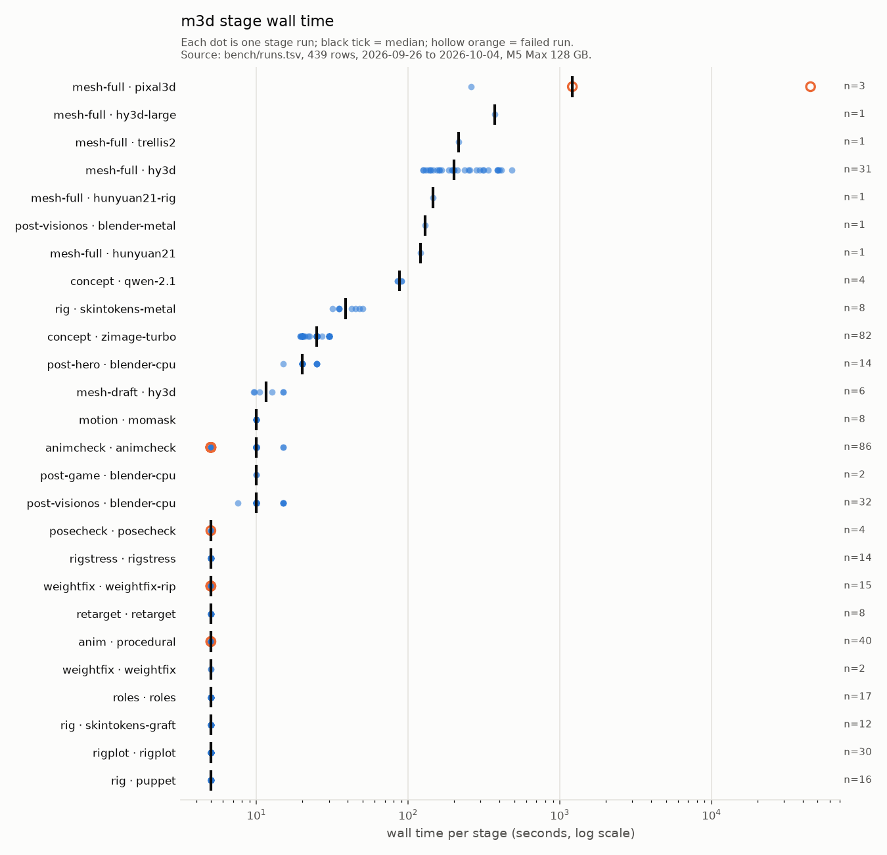

<sub>The Pixal3D outliers are real: two failed runs before the fixes, one stopped at 1,208 s and one that hung for 12.5 hours on the GPU (2026-09-26/27, see below); the fixed run took 260 s. Hollow orange rings are failed runs (15 of 439).</sub>

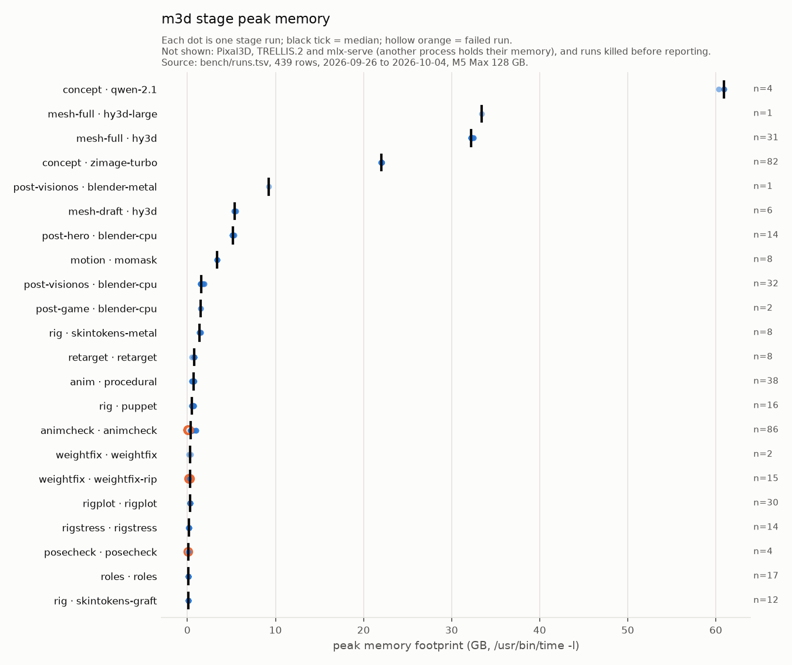

<sub>Image and mesh generation dominate memory; everything after the mesh fits in a few GB. Qwen-Image's 61 GB is why it is not the default.</sub>

### Engines and concepts compared

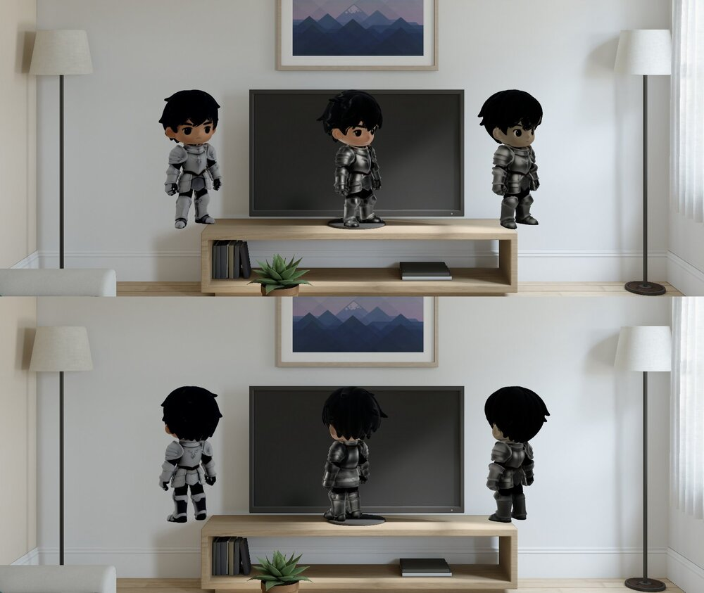

<sub>Same concept and seed, left to right: Hunyuan3D (hy3d), Pixal3D, TRELLIS.2, front (top) and back (bottom), RealityKit in the visionOS simulator, 2026-10-02.</sub>

Hunyuan has the most faithful textures (bright armour, natural skin); Pixal3D has good shape and hair but darker armour, and kept a ground disc from the concept's shadow; TRELLIS.2 has dark, desaturated textures. The 2.0-turbo shape model looks almost the same as shape-small, so the small one stays the default. Thin parts (hover bike fins) stay separate but carry speckled texture. Qwen-Image follows prompts more closely than Z-Image (it drew the speckled pot and a helmeted knight) but drew the hover bike with wheels, and its licence is research-only.

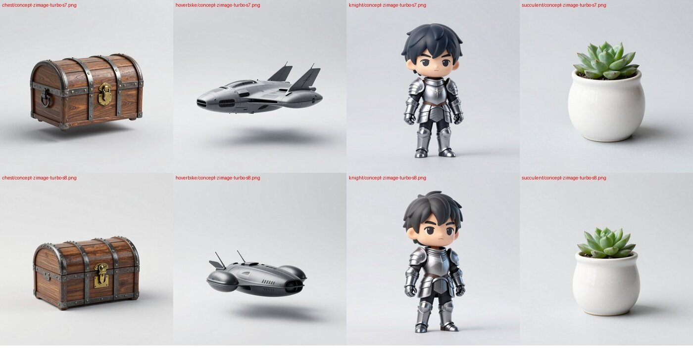

<sub>The first battery's concepts (Z-Image Turbo, seeds 7 and 8). Note the contact shadows the prompt asked it not to draw.</sub>

## What went wrong, and what guards it now

- **Graded backdrops become geometry.** Z-Image paints a softly graded grey backdrop despite the prompt; the colour key smeared (7-28% partial alpha, clean is < 1%) and Hunyuan built a wall behind the knight. Fixed: the default cutout is now Apple's on-device Vision mask (1.8-3.6% partial). Re-meshing the same concepts with it removed the wall, the floor disc and the debris. `m3d` still reports partial alpha and warns above `max_partial_pct`.
- **Contact shadows become a floor disc.** The prompt says "no shadow"; Z-Image drew one anyway on 3 of 8 concepts. The Vision cutout drops them; the colour key did not.

  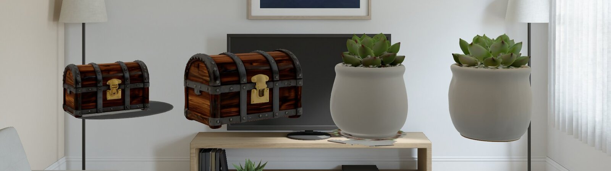

  <sub>The copy of each object with a floor disc or a ring of debris was meshed from the colour-key cutout; the clean copy from the Vision mask. RealityKit, visionOS simulator.</sub>
- **Blender's USDZ rendered black in RealityKit.** It passed `usdchecker --arkit`, yet every model was a black silhouette in the visionOS simulator. An A/B test showed only Apple's `usdextract` + `usdzip` conversion renders correctly (Blender feeds two material channels from one texture shader; RealityKit wants one per channel), so USDZs are made that way.
- **Pixal3D hung ~12 hours on the GPU.** The template's 1536 upsample made a 12M-face mesh; after the colour bake the normal/AO bakes sat silent. Fixed by `comfy_nodes/` (moves RemeshMesh, DecimateMesh and both bakes to CPU, the ComfyUI #16017 workaround) plus lighter settings (upsample 1024, remesh 512, 16 AO rays): 260 s. And no stage may hang again: every stage stops after 15 silent minutes or past its `max_seconds`.
- **An orphaned ComfyUI server held ~70 GB after a job.** A watchdog SIGTERM skipped `comfy3d.py`'s shutdown, and the guard missed the server because a venv's python shows in `ps` under its real interpreter path. Now `comfy3d.py` turns SIGTERM into a clean shutdown (`/interrupt`, then SIGINT, then SIGTERM; never SIGKILL, which can leak Metal memory until reboot), and the guard matches ComfyUI by its `main.py --port` arguments.
- **An earlier version of this README said the post pass ran on CPU.** One bake actually ran on Metal because the guard missed that orphaned server. Post now runs on CPU unless `--metal` is passed.
- **The GPU guard matched its own wrapper shells, and a `gh api …/mlx-serve/…` command.** It now matches the program being run, not words in its arguments, and skips its ancestors and `sh -c` wrappers.
- **Every animated USDZ played at one sample a second.** `usdextract` stamps `timeCodesPerSecond = 1` with keys in seconds and RealityKit evaluates at whole time codes: a 2 s hop became a 3-point triangle. `lib/usdretime.py` rescales to 30 codes/s.
- **RealityKit silently dropped every skeleton the converter wrote.** `usdextract` names joints by their full glTF node path (`n10/n8`); RealityKit refuses a skeleton whose root joint is not a single token, so only baked node transforms played (a "wave" was a body sway). `lib/usdjointfix.py` strips the prefix; verified against Apple's `toy_drummer.usdz`.
- **Bind ≠ rest made every chain over-rotate** (a straight-arm wave). `lib/usdbindfix.py` sets `bindTransforms` to the chained rest and shifts the points; verified with a live `SkeletalPosesComponent` probe and close-up angled bursts (whole-figure bursts had missed it).
- **Root motion only reaches the render on a non-joint node**, so per-clip GLBs carry the root's motion on a parent `m3d_mover`; **shape-key tracks are dropped** by the converter, so squash/stretch is root-bone scale; **a clip from one USDZ does not drive another file's skeleton**, so a runtime swaps per-clip entities.

### Characters that will move: `--rig-ready`, posecheck, rigstress

A live test in which a local model drove `m3d` unaided (make a teddy, make it wave and jump) traced a floppy wave to the concept image: arms drawn against the body fused to the torso in the mesh, and no rig can recover surfaces the mesher never built. The guards, in pipeline order:

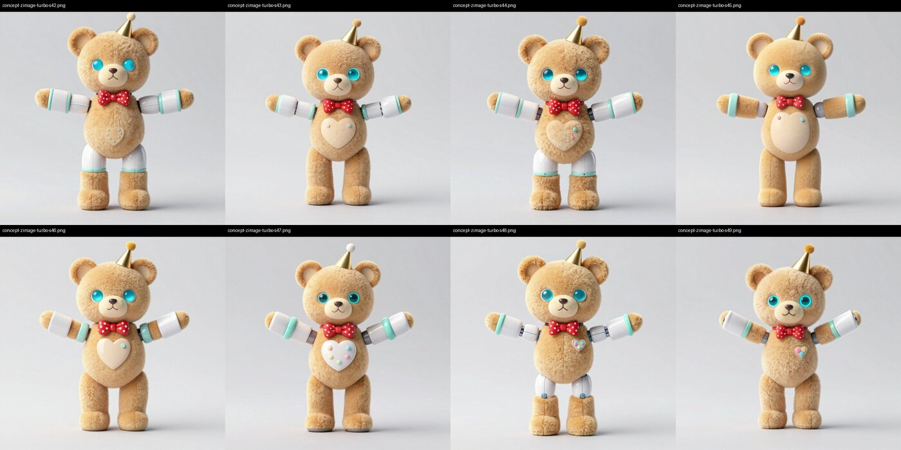

<sub>`m3d concept … --rig-ready --variants 8`: the strict "airplane wings" T-pose template. AI-generated (Z-Image Turbo).</sub>

| stage | guard | measured |
|---|---|---|
| concept | `--rig-ready`: front view, strict T-pose (`m3d.toml` `template_rig`) | notch 0.36-0.45 vs 0.145-0.178 without |
| concept | `lib/posecheck.py`: Vision cutout of every variant; `notch` = empty area inside the convex hull of the shoulders-to-hips band; `make` meshes the best, warns under 0.40 | meshed: A-pose 0.246 and wide T-pose 0.261 fused under the arm, airplane T-pose 0.453 clean |
| rig | `lib/rigstress.py`: each limb swung in numpy (arms to 130° at the shoulder, legs 60° forward), measured with animcheck's web metric | teddy 0.020 (fused) → 0.012 (wide T) → 0.0013 arms (airplane T); lamp 0.000 |
| animate | animcheck `web_area` / `web_sheet` (skin stretched > 1.5x into sheets); fail ≥ 0.010 / 0.005 | lamp clips 0.000; the first teddy wave 0.0195 |

Judge characters on textured close-ups, not on the numbers alone. Two fixes that passed the numbers failed by eye on the teddy and were dropped: weight diffusion around the shoulder (no gain), and an action-figure rebuild from the auto-rig (web 0, but grey socket balls and jagged fur on a plush).

### See-through glass (`--glass`)

The engines paint opaque surfaces only, so tinted glass (lantern panes, bottles) comes out solid. `m3d post model.glb --preset hero --glass green` finds the glass by colour in the baked texture and gives those faces a transparent glossy material (default opacity 0.45, `--glass-alpha`). Limits: the mesh is a hollow shell, so the inside looks empty and somewhat blotchy, and only clearly tinted glass can be found (clear glass has no colour to key on).

### Driven by a local agent

The `skills/m3d` skill lets a coding agent call `m3d`. In live tests (2026-10-02/03), the terminal agent pi, running a local Qwen model through llama-swap on the same Mac, made a hero USDZ unaided and rigged and animated the lamp unaided in 7 min 41 s, using `--yield-llm` to hand the GPU over and back (unload under 2 s, reload 8-28 s). Those tests are what moved `[yield]` lines to stderr under `--json`, made `render.sh` accept bare file names, and added the `--rig-ready` guards above.

## Requirements

- **Apple Silicon Mac.** Built and measured only on an M5 Max with 128 GB on macOS 27. The default text-to-USDZ path peaked at 32 GB (Hunyuan paint), Qwen-Image at 61 GB; smaller machines are untested.
- **macOS 27** for the USD command-line tools (`usdextract`, `usdzip`, `usdchecker`) and Apple Vision; **Xcode 27 + xcodegen** only for the RealityKit check (`viewer/`).
- **Blender 5.2** (headless), **uv**, Python 3.11-3.12.
- About **45 GB of weights** (`bench/fetch-weights.sh`), plus the engine clones below.

## Setup

```bash
git clone https://github.com/mthomas100/local-3d ~/repos/local-3d
export M3D_REPOS=~/repos          # where the engine clones live (this is the default)
# Hunyuan engine: hy3d-mcp's installer fixes the metallib, the paint-large
# layout and the worker venv that the upstream README leaves out
git clone https://github.com/ZimengXiong/Hunyuan3D-Swift $M3D_REPOS/Hunyuan3D-Swift
git clone https://github.com/JimCline/hy3d-mcp $M3D_REPOS/hy3d-mcp
$M3D_REPOS/hy3d-mcp/install.sh --repo $M3D_REPOS/Hunyuan3D-Swift --worker-venv ~/.hy3d/worker-venv
uv tool install mflux                       # text → image
git clone https://github.com/Comfy-Org/ComfyUI $M3D_REPOS/ComfyUI   # Pixal3D / TRELLIS.2 (optional)
cd $M3D_REPOS/ComfyUI && uv venv .venv --python 3.12 && uv pip install --python .venv/bin/python torch torchvision torchaudio -r requirements.txt
cd ~/repos/local-3d
bench/fetch-weights.sh                      # every weight, in priority order (~45 GB)
swiftc -O lib/vision-cutout.swift -o bin/vision-cutout
brew install xcodegen blender               # viewer/render.sh builds its project with xcodegen
ln -s ~/repos/local-3d/bin/m3d ~/.local/bin/m3d
m3d make "a small brass robot" --dry-run    # check every path resolves before spending GPU time
```

Rigging needs [skin-tokens.cpp](https://github.com/localai-org/skin-tokens.cpp) built in `$M3D_REPOS/skin-tokens.cpp` and its GGUF weights in `~/.skintokens/gguf`; text-to-motion needs [momask-codes](https://github.com/EricGuo5513/momask-codes) in `$M3D_REPOS/momask-codes` (`lib/momask.py` sets up its venv and launcher in `~/.momask`). The exact build and download commands are printed by `m3d rig` / `m3d animate` when something is missing.

Paths in `m3d.toml` expand `~` and environment variables: `M3D_ROOT` (this checkout), `M3D_REPOS` (default `~/repos`), `M3D_OUT` (outputs, default `~/3d/m3d`) and `M3D_BLENDER` (default: `blender` on `PATH`). Export any of them, or edit the row.

## Status and limitations

- Working and committed: text/photo → GLB + USDZ, three mesh engines, glass, rig (two riggers), animate (procedural and text-to-motion), per-clip USDZ that RealityKit plays, the checks.
- Not verified: import into a game engine (none was installed); `hunyuan21-rig` through mlx-serve is wired but mlx-serve ignored the rig option, so it fails loudly and rigging goes through `m3d rig`.
- `render.sh --anim`'s seek-and-pause frames render the rest pose (a false negative); the looping capture and `viewer/burst.sh` are the truth until that is fixed.
- Characters with arms near the body still fuse at the armpit; `--rig-ready` and posecheck reduce it, they do not remove it. Most animcheck verdicts on auto-rigged characters are **warn**, not ok.
- Meshes are hollow shells; anything the concept image does not show (the inside of a lamp shade, the back of a figure) is guessed by the texture model.
- On the Vision Pro itself, `viewer/` was built with automatic signing (`DEVELOPMENT_TEAM=YOUR_TEAM_ID`) and installed with `xcrun devicectl device install app`; that path is lightly tested.

## Credits and licences

The code in this repository is MIT ([LICENSE](LICENSE)). It drives, but does not include, these models and tools; check each licence before shipping anything you make:

- **Hunyuan3D** (Tencent; [Hunyuan3D-Swift](https://github.com/ZimengXiong/Hunyuan3D-Swift) port, [hy3d-mcp](https://github.com/JimCline/hy3d-mcp) workers): the Tencent Hunyuan 3D 2.1 community licence excludes the EU, the UK and South Korea, including displaying output there, and a licensee whose products had more than 1 million monthly active users must request a separate licence from Tencent. For a game sold in those regions, use Pixal3D or TRELLIS.2 (MIT models, plus Meta's DINOv3 licence for the encoder).
- **Pixal3D, TRELLIS.2** (through [ComfyUI](https://github.com/Comfy-Org/ComfyUI)): MIT models, plus Meta's DINOv3 licence for the image encoder they share.
- **DINOv3 encoder** (Comfy-Org repack, used by Pixal3D and TRELLIS.2): Meta DINOv3 licence.
- **MoGe-2** (geometry estimation in the ComfyUI route) and **BiRefNet** (its cutout): MIT.
- **Z-Image Turbo** (via [mflux](https://github.com/filipstrand/mflux)): Apache 2.0. **Qwen-Image-2.1**: Qwen Research License (checked 2026-10-02), so not for anything sold.
- Never use **RMBG-2.0** for matting (CC BY-NC); Apple Vision and BiRefNet are clean.
- **SkinTokens** weights are MIT (VAST), **skin-tokens.cpp** Apache-2.0.
- **MoMask**'s code is MIT, but its HumanML3D/AMASS training data is research-only: `--text` clips are not for anything sold. The procedural clips and puppet rigs are this repo's own code.
- Apple's USD tools, Vision framework and RealityKit; Blender (GPL, run as an external program).

**All images and animations in `docs/media/` are AI-generated** (concepts by Z-Image Turbo, meshes and textures by Hunyuan3D, Pixal3D or TRELLIS.2), rigged and animated by this code, and rendered by Blender or by RealityKit in the visionOS simulator, whose default room environment is Apple's.
